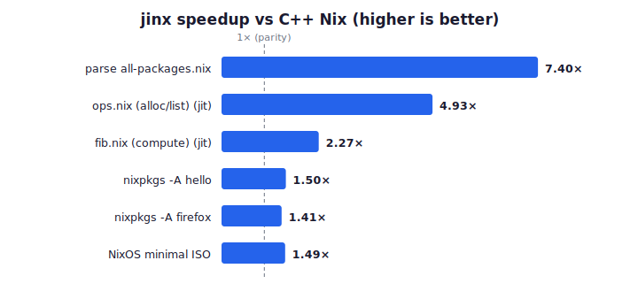
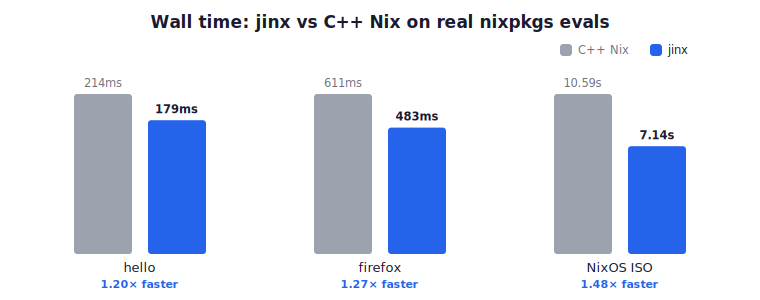
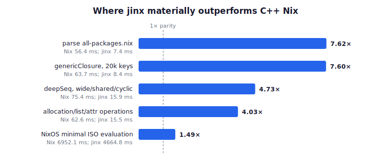
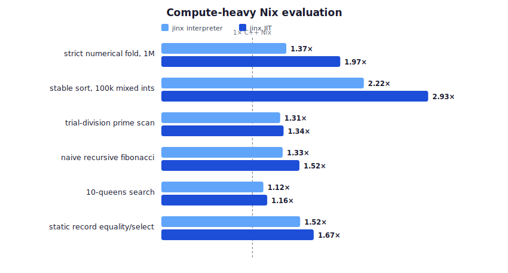
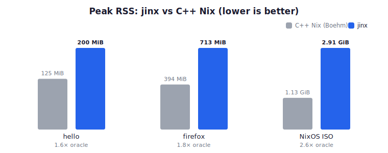

<div align="center">

# jinx

**A JIT-compiling, garbage-collected [Nix](https://github.com/NixOS/nix) evaluator in Rust** — byte-identical `.drv` files, store paths, and evaluation output (error messages and traces included) across the entire language conformance corpus.



</div>

Wire-compatible for the `nix-instantiate` and `nix eval` surface (flakes included),
built and validated against Nix master (2.36.0pre, worker protocol 1.39) on
aarch64-darwin. Behaviors outside the 467-fixture corpus that still differ are listed
honestly in [`KNOWN_DIVERGENCES.md`](KNOWN_DIVERGENCES.md).

## Status

| Surface | Result |
|---|---|
| Language test suite (467 fixtures) | **466 pass / 0 fail / 1 skip**, byte-exact stdout + stderr (incl. `--show-trace`) |
| nixpkgs derivation parity | `hello`, `firefox`, ISO, 49-package sample — **byte-identical `.drv` paths** vs C++ Nix |
| Flakes | `nix eval` parity; `flake.lock` v5–7, `path` + `git+file` fetchers, registry (no lock *generation*) |
| Store | real writes via `nix-daemon` — `.drv`, `toFile`, `path`/`filterSource`, IFD builds |
| GC | non-moving sticky-mark generational mark-region (Immix-style value-cell + 128-byte data-line recycling, precise execution safepoints, prefetched **parallel work-stealing mark**); passes the suite under forced collection |
| JIT | Cranelift, all 40 opcodes; off by default — `--jit` wins only on compute-dense code |
| Performance | `parse` **~7.4×**, `hello` **~1.50×**, `firefox` **~1.41×**, NixOS ISO **~1.49×** faster than C++ Nix; x86_64-linux validated ([benchmarks](#benchmarks)) |

## Layout

- `crates/jinx-syntax` — hand-written lexer/parser mirroring Nix's grammar, byte-exact
  `--parse` pretty-printer and parse-error strings
- `crates/jinx-eval` — GC heap, bytecode compiler (flat closures/upvalues), VM,
  all builtins, string contexts, printers (value/XML/JSON/TOML), POSIX-ERE regex engine
- `crates/jinx-jit` — Cranelift codegen for hot chunks (shares the interpreter's frame
  layout; transparent fallback)
- `crates/jinx-store` — store-path math, derivation ATerm + `hashDerivationModulo`,
  NAR, daemon worker-protocol client
- `crates/jinx-fetch`, `crates/jinx-flake` — fetchers (path, git+file), `flake.lock`,
  flakerefs, registry
- `crates/jinx-cli` — the `jinx` binary: `nix-instantiate` personality (default) and
  `jinx eval` (`nix eval` personality)
- `crates/jinx-conformance` — parallel runner replicating upstream `lang.sh` semantics

## Usage

```sh
cargo build --release -p jinx-cli

# nix-instantiate personality
./target/release/jinx --readonly-mode /path/to/nixpkgs -A hello
./target/release/jinx --eval --strict -E '1 + 1'

# nix eval personality (flakes)
./target/release/jinx eval --extra-experimental-features 'nix-command flakes' \
  --raw /path/to/nixpkgs#hello.drvPath

# nix search personality — hot/cold eval cache (first run evaluates + caches
# the whole package set; later runs read the cache and skip evaluation)
./target/release/jinx search /path/to/nixpkgs ripgrep
```

Knobs: `--jit=on|off` / `JINX_JIT` / `JINX_JIT_THRESHOLD` (JIT off by default),
`JINX_JIT_BG=0` (disable background compilation); `JINX_GC_OFF`, `JINX_GC_STRESS`,
`JINX_GC_STATS`, `JINX_GC_HEAP_MB` (GC min-trigger 1 GiB), `JINX_GC_GEN=0`
(disable generational collection), `JINX_GC_YOUNG_MB` (young-gen trigger),
`JINX_GC_THREADS` (parallel marker threads), `JINX_GC_GROW` (major growth
watermark, percent).

For the benchmark numbers above, build with PGO: `bash bench/pgo-build.sh`
(instrument → train → merge → rebuild; see `bench/REPORT.md`).

## Benchmarks

Measured with [hyperfine](https://github.com/sharkdp/hyperfine) against the
pinned C++ Nix oracle (`.oracle/bin/nix-instantiate`) on nixpkgs, PGO build,
aarch64-darwin. `parse` and the `-A` evals run jinx's shipping default (JIT
off); the compute micro-benchmarks show the opt-in JIT.

<div align="center"></div>

The parity-checked evaluator-strength suite highlights the shapes where jinx's
specialized representations and builtins have a clear advantage. Each command
must produce byte-identical stdout before it is timed; see
[`bench/STRENGTHS.md`](bench/STRENGTHS.md).

<div align="center"></div>

The self-contained [compute suite](bench/COMPUTE.md) separately exercises
strict numerical folds, stable sorting, prime scanning, naive recursion, and
combinatorial search, plus repeated static-record construction and equality.
Every published workload outperforms C++ Nix with the shipping interpreter;
the opt-in JIT extends those wins further.

<div align="center"></div>

jinx trades memory for speed — its non-moving generational GC keeps a larger
resident set than C++ Nix's Boehm collector (deliberate; `JINX_GC_GEN=0` /
`JINX_GC_HEAP_MB` trade it back):

<div align="center"></div>

### Reproduce

```sh
bash bench/pgo-build.sh                              # PGO binary (the numbers above)
nix shell nixpkgs#hyperfine -c bash bench/run-benchmarks.sh   # -> bench/results/*.json + rss.txt
bash bench/run-compute-benchmarks.sh                 # self-contained compute kernels
python3 bench/plot.py                                # bench/results/ -> bench/graphs/*.svg
```

`run-benchmarks.sh` writes per-benchmark hyperfine JSON, a peak-RSS table, and GC
stats; `plot.py` is zero-dependency (standard library only). Wall-time ratios are
load-sensitive — run on a quiet machine. Full methodology + per-phase attribution
is in `bench/REPORT.md`.

### `nix search` workload + eval cache

`nix search` is the heaviest common eval: to match a query it forces `name` +
`meta.description` for the **entire** recursively-expanded package set
(~114k–119k derivations, ~52M thunks, ~7 GB allocated). `bench/search-workload.nix`
replicates that walk as a plain expression both engines run identically (same
result, same ~51M thunks):

| cold (no cache) | wall | total CPU |
|---|---|---|
| C++ Nix | 12.5 s | 19.7 s |
| **jinx** | 14.4 s | **17.4 s** |

Cold is the wrong way to search, though. `jinx search` (like `nix search`)
uses a **hot/cold eval cache** stored in **Nix's exact SQLite schema**
(`Attributes(parent, name, type, value, context)` + the `AttrType` encoding, so
the DB is format-compatible): the first search evaluates and populates the cache,
later searches read it back and skip evaluation:

```
jinx search: cold (evaluated), 113918 packages, 8 matches in 14.8s
jinx search: hot (cache),      113918 packages, 8 matches in 0.35s   # 42× faster
```

jinx's matches are identical to `nix search`'s. Sharing Nix's *exact* cache file
additionally needs `LockedFlake::getFingerprint` + Nix's precise `AttrCursor`
tree shape (a follow-up); the on-disk schema is already interoperable.

## Conformance

```sh
# language suite (corpus = a NixOS/nix checkout's tests/functional;
# --corpus or $JINX_CONFORMANCE_CORPUS)
cargo run -q -p jinx-conformance -- --engine ./target/release/jinx \
  --corpus /path/to/nix/tests/functional

# strictest correctness gate: every chunk JIT-compiled + GC every ~4 KB
JINX_JIT=1 JINX_JIT_THRESHOLD=0 JINX_GC_STRESS=1 \
  cargo run -q -p jinx-conformance -- --engine ./target/release/jinx \
  --corpus /path/to/nix/tests/functional
```

## Known limitations

- Flake lock **generation** (`lockFlake`) is not implemented — an on-disk `flake.lock`
  (or lock-free single flake) is required; `github:`/tarball/network-git fetchers are
  not yet wired (flake inputs of type `path` and `git+file` are).
- `builtins.fetchGit` and `builtins.storePath` are not implemented.
- Under `--readonly-mode` / `dummy://`, store-path *validity* checks are approximated by
  filesystem checks, so some not-yet-built-path errors C++ raises do not fire identically
  (real builds via the daemon are byte-identical).
- Evaluator surface only: `nix build`-style scheduling, substituters, the daemon
  *server*, `nix repl`, and the debugger are out of scope; builds happen via the real
  `nix-daemon` (IFD works this way).
- Eval caching (`~/.cache/nix/eval-cache`) is not implemented.

See [`KNOWN_DIVERGENCES.md`](KNOWN_DIVERGENCES.md) for the full, itemized list of
observable differences outside the conformance corpus (upstream quirks, platform-specific
rendering, and library-driven parse-error wording).

## License & provenance

LGPL-2.1-or-later (see `COPYING`), matching upstream Nix. jinx is an independent
reimplementation whose semantics were ported by reading the
[NixOS/nix](https://github.com/NixOS/nix) sources; a few Nix-language files
(`derivation.nix`, `call-flake.nix`) are vendored verbatim from that repository.
Conformance fixtures live in the upstream repo and are read at test time (point
`--corpus` / `$JINX_CONFORMANCE_CORPUS` at a checkout), not vendored.
